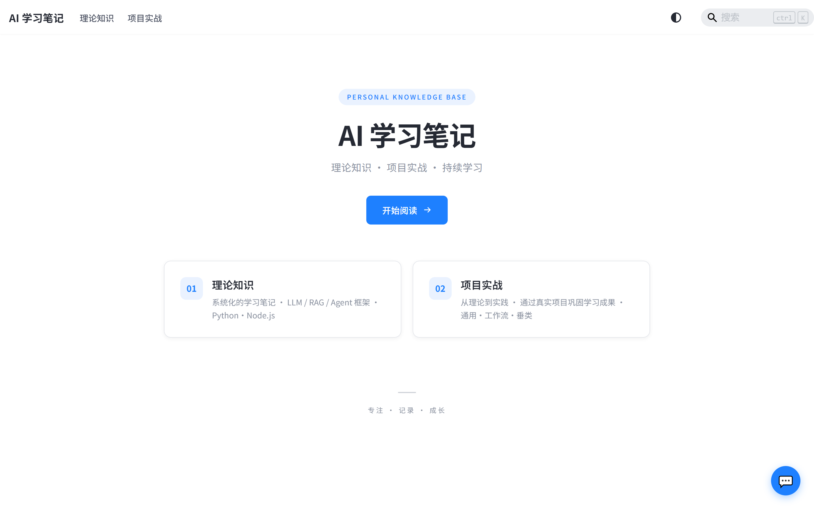
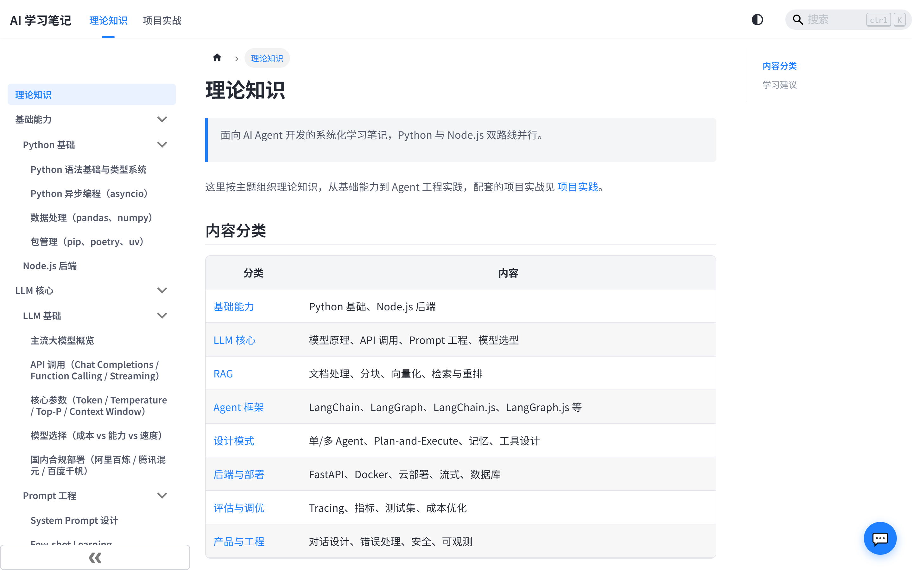
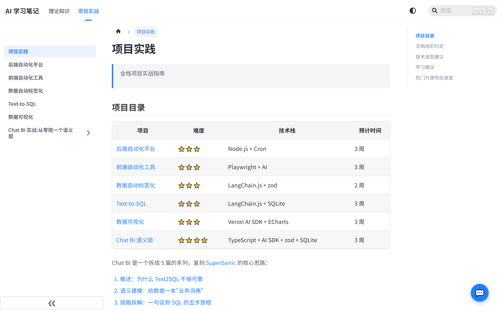
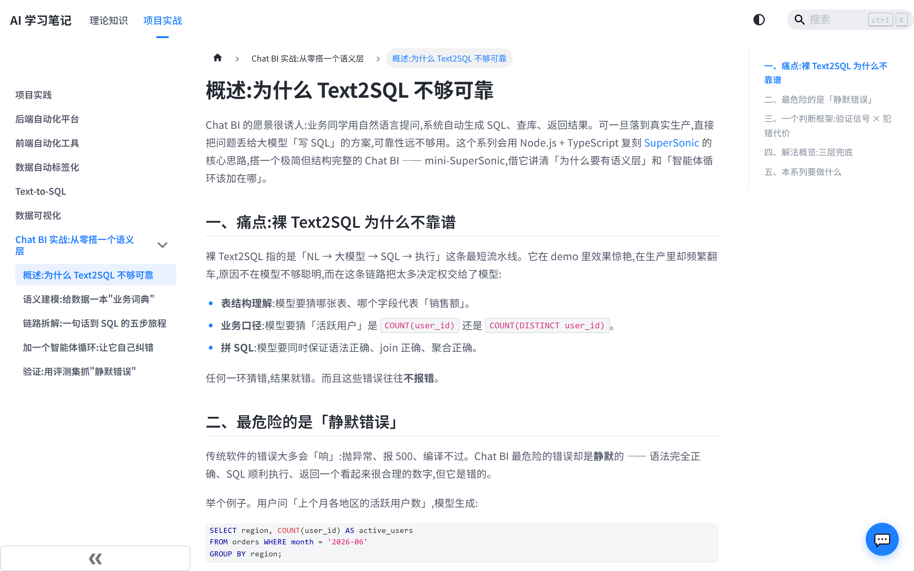
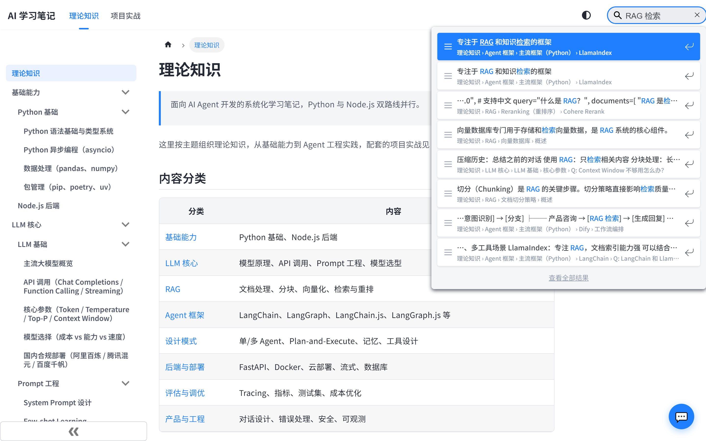
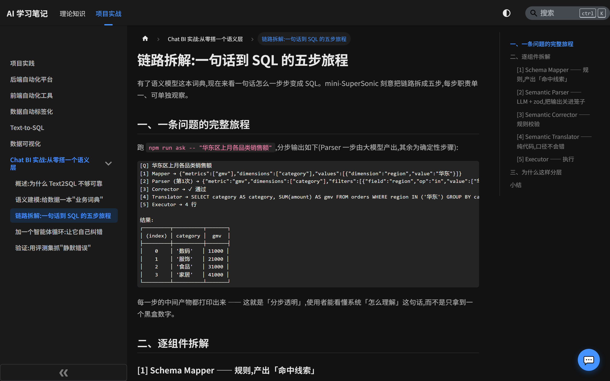

# AI 学习笔记

基于 Docusaurus 3.10 + React 19 构建的个人学习笔记站点，内容分「理论知识」与「项目实战」两块，带本地中英文搜索和一个 AI 聊天助手。

🔗 **在线预览**：https://kayla-wang.github.io/Personal-Blog-AI/ （GitHub Pages 镜像，纯静态，未启用 AI 聊天）

## 界面预览

| 首页 | 理论知识（`/notes`） |
|:--:|:--:|
|  |  |
| 两块内容入口 | 八大分类 + 目录结构自动生成的侧边栏 |

| 项目实战（`/projects`） | 正文页 |
|:--:|:--:|
|  |  |
| 项目清单：难度、技术栈、预计时间 | 左侧目录 + 右侧本页锚点 |

| 本地全文搜索 | 暗色模式 |
|:--:|:--:|
|  |  |
| 中英文分词，命中正文与代码块（构建后生效） | 全站跟随系统主题 |

## 站点内容

| 板块 | 路由 | 内容目录 | 说明 |
|------|------|----------|------|
| 理论知识 | `/notes` | `docs/` | 按主题分 8 个分类：基础能力、LLM 核心、RAG、Agent 框架、设计模式、后端与部署、评估与调优、产品与工程 |
| 项目实战 | `/projects` | `projects/` | 后端自动化、前端自动化、数据自动标签化、Text-to-SQL、数据可视化、Chat BI 系列 |

侧边栏均由目录结构自动生成（`sidebars.js` / `sidebarsProjects.js`），新增分类只要建文件夹。博客（blog）功能已关闭。

## 本地开发

```bash
npm install
npm run start          # http://localhost:3000
npm run build          # 生产构建，输出 build/
npm run serve          # 预览生产构建
npm run clear          # 配置/内容改动后异常时先清缓存
```

需要 Node >= 20。

### AI 聊天后端（可选）

前端悬浮聊天窗请求 `/api/chat`，本地要联通需另起后端：

```bash
cd server
npm install
# 手写 server/.env：AI_BASE_URL / AI_API_KEY / AI_MODEL（OpenAI 兼容接口，如通义千问）
npm run dev               # 监听 :3001
```

另有一份 Vercel Edge Function 实现 `api/chat.js`，硬编码通义千问，只需 `DASHSCOPE_API_KEY`（见根目录 `.env.example`）。两套后端择一部署即可。

## 配套示例代码

`examples/mini-chatbi/` 是「项目实战 → Chat BI」系列的可运行示例（简化版 SuperSonic：语义层 + 纠错循环 + 评测集），独立依赖树，不参与站点构建：

```bash
cd examples/mini-chatbi
npm install
cp .env.example .env   # AI_BASE_URL / AI_API_KEY / AI_MODEL
npm run seed           # 生成 SQLite 示例库
npm run ask "上个月华东数码类的销售额"
npm run eval           # 跑黄金样本评测
npm test               # vitest
```

用到内置 `node:sqlite`，需 Node >= 22.13（Node 20 没有该模块，22.5–22.12 需 `--experimental-sqlite`）。

## 部署

推送到 `main` 会同时触发两条 GitHub Actions：

### 1. 阿里云自托管（主站，`.github/workflows/deploy.yml`）

- `npm run build` 后用 rsync 同步 `build/` 到服务器 `/var/www/blog`；
- SSH 进服务器 `pm2 reload blog-api` 重启 `/var/www/blog-api` 的 API 服务。

需要的 GitHub Secrets：`SSH_PRIVATE_KEY`、`REMOTE_HOST`、`REMOTE_USER`。

服务器初始化与反代配置见 [deploy/setup-server.sh](deploy/setup-server.sh)、[deploy/nginx.conf](deploy/nginx.conf)（Nginx 需把 `/api/` 反代到 `127.0.0.1:3001`，聊天才能用）。

### 2. GitHub Pages 镜像（`.github/workflows/gh-pages.yml`）

以 `DEPLOY_TARGET=pages` 构建，切换到 `https://kayla-wang.github.io/Personal-Blog-AI/` 的 url/baseUrl，并关闭 AI 聊天组件（Pages 是纯静态，没有后端）。`baseUrl` 大小写须与仓库名 `Personal-Blog-AI` 一致，Pages 路径大小写敏感。

## 添加内容

在 `docs/`（理论知识）或 `projects/`（项目实战）下建文件夹和 Markdown，用 frontmatter 设元信息：

```markdown
---
title: 文章标题
tags: [标签1, 标签2]
sidebar_position: 1
---
```

内容按 MDX 解析：正文里的 `{...}` 会被当作表达式求值，裸 URL 之外的相对链接要指向真实存在的文件，否则构建会失败（`onBrokenLinks: 'throw'`）。

## 目录结构

```
docs/                   # 理论知识（路由 /notes）
  superpowers/          # 计划与设计文档，会随站点发布
projects/               # 项目实战（路由 /projects）
examples/mini-chatbi/   # 配套可运行示例，独立依赖
src/                    # 页面、组件（AIChatWidget）、主题包装（theme/Root.js）
static/                 # 静态资源
server/                 # Express + PM2 聊天后端（阿里云）
api/chat.js             # Vercel Edge Function 版聊天后端
deploy/                 # Nginx 配置与服务器初始化脚本
superpowers/            # 早期计划与设计文档（不发布）
```
